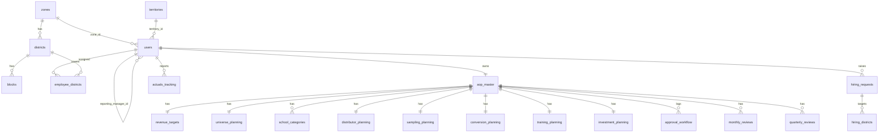

# AOP Platform FY26-27 — Architecture, Full Flow & Database Reference

> A single reference document covering **what the system does**, **how it is built**,
> **the end‑to‑end flow**, and **every database table** (existing + the ones you still
> need to create). Use this as the hand‑off / build reference.

---

## 1. What this product is

A **mobile-first web platform** for building the **Annual Operating Plan (AOP)** of a
nationwide field‑sales organisation that sells educational products to schools.

The org is a 4-level hierarchy:

```
ADMIN  →  ZDM (Zone)  →  BDM (District line)  →  BDA (own territory)
```

Each field employee builds **one AOP per fiscal year (FY26-27)** through a guided
**7-stage wizard** with live calculations, then the plan flows through an
**approval workflow** (submit → review → approve / request changes / reject).
ZDMs see a **zone roll-up** (auto-aggregated from all team members) and a
**leadership dashboard**.

---

## 2. Technology architecture

| Layer | Technology | Notes |
|-------|-----------|-------|
| Framework | **Next.js 15** (App Router) + React 19 | `src/app/*` routes |
| Language | **TypeScript** | Domain types in `src/lib/types.ts` |
| Styling | **Tailwind CSS v4** + PostCSS | `src/app/globals.css` |
| Validation | **Zod** | `src/lib/validation.ts` (per-stage schemas) |
| Backend (optional) | **Supabase** (Postgres + Auth + RLS) | `supabase/migrations/*` |
| State (demo) | React Context + `localStorage` | `src/lib/store.tsx` |

### 2.1 Two run modes

The app is designed to run **with or without a backend**:

```
┌─────────────────────────── DEMO / MOCK MODE (default) ───────────────────────────┐
│  No env vars set.  Data = seeded in-memory (mock-data.ts) + localStorage drafts.  │
│  Auth = quick-login persona switch.  Calc engine = lib/calc.ts.                    │
└───────────────────────────────────────────────────────────────────────────────────┘
┌─────────────────────────── LIVE / SUPABASE MODE (optional) ──────────────────────┐
│  NEXT_PUBLIC_SUPABASE_URL + ANON_KEY set.  Data = Postgres (18+ tables).           │
│  Auth = Supabase Auth.  Security = Row-Level Security.  KPIs = SQL view v_aop_kpis. │
└───────────────────────────────────────────────────────────────────────────────────┘
```

The same formulas exist in **two mirrored places**: `lib/calc.ts` (TypeScript, demo)
and the SQL view `v_aop_kpis` (Postgres, live). Keep them in sync.

### 2.2 Code map

```
src/
  app/                 # Routes
    login/             #   persona / Supabase login
    page.tsx (/)       #   employee card list (home)
    view/              #   BDA's own-plan view
    aop/[employeeId]/  #   THE 7-STAGE WIZARD
    dashboard/         #   team comparison + ZDM rollup
    hiring/            #   hiring requests
    admin/             #   admin console
  components/
    AppShell.tsx       # nav shell
    wizard/
      Wizard.tsx       # stepper, state machine, submit/approve actions
      stages.tsx       # Stage 2-7 UI (Revenue…Collection)
    HiringForm.tsx, EmployeeProfile.tsx, TeamCommandCenter.tsx, ui.tsx …
  lib/
    types.ts           # domain types (mirror of DB)
    calc.ts            # calculation engine (mirrors v_aop_kpis)
    validation.ts      # Zod schemas + cross-field flags
    store.tsx          # auth, data, RBAC permissions, persistence
    master-data.ts     # zones / districts lookup
    mock-data.ts       # demo seed (mirrors seed.sql)
    supabase/          # browser + server clients (live mode)
supabase/
  migrations/0001_schema.sql            # 18 core tables + v_aop_kpis
  migrations/0002_rls.sql               # RLS policies + triggers
  migrations/0003_enterprise_redesign.sql  # zones/districts/blocks, ADMIN, rollup view
  seed.sql                              # demo data
docs/                  # 15-section product/design spec
documentation/database-mapping/        # field/KPI/table discovery CSVs + xlsx
```

---

## 3. Roles & access control (RBAC)

Permissions are enforced in `store.tsx` (demo) and by RLS policies (live).

| Capability | ADMIN | ZDM | BDM | BDA |
|-----------|:-----:|:---:|:---:|:---:|
| See everyone | ✅ | zone only | own line | self only |
| View an AOP | any | subordinates + self | subordinates + self | self |
| **Edit** an AOP | any | subordinates¹ | ❌ | ❌² |
| Approve / reject AOP | subordinates | subordinates | ❌ | ❌ |
| Edit employee profile | any | subordinates | ❌ | ❌ |
| Raise hiring request | ✅ | ✅ | ❌ | ❌ |
| Manage hiring status | ✅ | ✅ | ❌ | ❌ |

¹ In the **enterprise redesign** (`0003`), planning data is **writable only by ZDM/ADMIN**
(`can_edit_user()`), with BDM/BDA as read/own-view. The demo store reflects the same rule
(`canEditAop` returns true only for ADMIN, or ZDM over subordinates).
² A ZDM's own "AOP" is the **roll-up** (`isRollup`) — read-only, never directly editable.

**Visibility** is computed by walking the `reporting_manager_id` tree
(`subordinates()` / `employee_hierarchy` closure table in SQL).

---

## 4. End-to-end flow

### 4.1 Navigation flow

```
/login ──(pick persona / sign in)──► /  (employee cards)
                                      │
        ┌─────────────────────────────┼──────────────────────────────┐
        ▼                             ▼                              ▼
  /aop/[employeeId]            /dashboard                       /hiring
  (7-stage wizard)        (team compare + ZDM rollup)      (hiring requests)
        │
        └─► Submit ─► manager opens same wizard ─► Approve / Request changes / Reject
```

### 4.2 The AOP wizard — 8 steps

Defined in `Wizard.tsx → STAGES`. Steps map to data sections on the `Aop` object and
to DB tables.

| # | Step (UI) | Purpose | Writes to (section / table) |
|---|-----------|---------|------------------------------|
| 1 | **Hiring** | Identify manpower gaps before planning; smart-defaults launcher | `hiring_requests` |
| 2 | **Revenue** | Total + 5 category targets, AOV; auto-split by last-year mix | `revenue.*` → `revenue_targets` |
| 3 | **Universe** | School counts, 5 category rows, growth/retention plans | `universe.*` → `universe_planning`, `school_categories`, `distributor_planning` |
| 4 | **Sampling** | Free-trial volumes + conversion assumptions | `sampling.*` → `sampling_planning`, `conversion_planning` |
| 5 | **Training** | Trainings & workshops counts | `training.*` → `training_planning` |
| 6 | **Cost** (Investment) | All planned spend across 12 cost heads | `investment.*` → `investment_planning` |
| 7 | **Collection** | Auto cash-collection plan by region × milestone (no input) | `collection.*` → `collection_planning`* |
| 8 | **Review** | Auto KPIs, validation flags, summary, **Submit / Approve** | `approval_workflow`, `aop_master.status` |

\* `collection_planning` is a **proposed** table — today the collection step is computed
in code from region constants (see §7).

### 4.3 Per-step behaviour highlights

- **Live calculations**: every numeric input recomputes KPI strips instantly
  (`computeRevenueKpis`, `computeUniverseKpis`, `computeSamplingKpis`,
  `computeInvestmentKpis`, `computeAopKpis`).
- **Auto-split** (Revenue): distributes the total target across the 5 categories using
  last year's revenue mix.
- **Smart defaults** (Hiring step): pre-fills the whole plan from last-year revenue × 1.12
  growth.
- **Validation gate**: `goNext()` runs the stage's Zod schema; the stepper dot turns
  green (valid) / red (invalid) / grey (untouched).
- **Read-only / locked**: AOPs in `submitted | in_review | approved` are locked; roll-ups
  are always read-only.
- **Collection** is fully derived (region collection % × milestone phasing × revenue
  target) — nothing is typed.

### 4.4 AOP status state machine

```
not_started ──(first save)──► draft ──(submit)──► submitted ──► in_review
                                 ▲                                   │
                                 │                          ┌────────┼─────────┐
                                 │                          ▼        ▼         ▼
                          changes_requested ◄──────── request_changes  approve  reject
                                                                       │        │
                                                                       ▼        ▼
                                                                   approved   rejected
```

Type: `AopStatus` in `types.ts`. Transitions are recorded as `approval_workflow` events
(`submit | approve | reject | request_changes`) plus an `audit_logs` row.

### 4.5 Approval workflow

1. **Editor** (ZDM/ADMIN) completes wizard → **Submit** → status `submitted`, event logged,
   plan **locks**, confetti, redirect home.
2. **Approver** (manager) opens the same wizard → **Review** step shows
   **Approve / Request changes / Reject** with a comment box.
3. Action sets status and appends an `approval_workflow` event + `audit_logs` entry.
   `request_changes` reopens the plan for the owner.

### 4.6 ZDM roll-up

A ZDM has no editable plan of their own. `getAop(zdmId)` calls
`aggregateTeamAop(teamAops, zdmId, zoneId)` which **sums** revenue, universe, sampling,
training, investment across all descendants and **derives** a combined status
(`deriveRollupStatus`). In live mode this is the `v_zdm_rollup_aop` SQL view.

---

## 5. Calculation engine (KPIs)

Pure functions in `lib/calc.ts`, mirrored by the SQL view `v_aop_kpis`.

| KPI | Formula |
|-----|---------|
| Revenue growth % | `(total_target − last_year) / last_year × 100` |
| AOV growth % | `(target_aov − current_aov) / current_aov × 100` |
| Category mismatch | `total_target − Σ(5 category targets)` (must be 0) |
| School growth % | `(Σ target_count − Σ current_count) / Σ current_count × 100` |
| Total samples | `Σ(7 sampling streams)` |
| Unique schools | `total_samples × unique_factor` |
| Cost / conversion | `sampling_cost / estimated_conversions` |
| Total investment | `Σ(12 cost heads)` |
| Investment % of revenue | `total_investment / total_target × 100` |
| ROI | `total_target / total_investment` |
| Collection target | `total_target × region_collection_% / 100` |
| Milestone amount | `total_target × cumulative_% / 100` |

**Validation flags** (`flagUnrealisticTargets`): category sum mismatch (error),
growth > 60 % (warn), negative growth (warn), implied rev/school ≫ AOV (warn),
sampling-to-new-schools > available non-user schools (error).

---

## 6. DATABASE REFERENCE — existing tables

> PostgreSQL / Supabase. UUID PKs (`gen_random_uuid()`), `numeric(14,2)` for INR money,
> `numeric(5,2)` for percentages, `created_at/updated_at timestamptz`.
> Source: `supabase/migrations/0001_schema.sql` (core) + `0003_enterprise_redesign.sql`.

### 6.1 Core schema — 18 tables (migration 0001)

| # | Table | Grain | Key columns | Relationships |
|---|-------|-------|-------------|---------------|
| 1 | **territories** | one per territory | `code`, `name`, `district`, `state`, `zone`, `base_location` | referenced by `users`, `hiring_requests` |
| 2 | **users** | one per employee (1:1 `auth.users`) | `employee_code`, `role` (ZDM/BDM/BDA/ADMIN), `reporting_manager_id`, `territory_id`, `current_revenue/target` | self-FK manager; → territories |
| 3 | **employee_hierarchy** | closure table | `ancestor_id`, `descendant_id`, `depth` | fast subtree queries over users |
| 4 | **aop_master** | one per user per FY | `user_id`, `fy`, `status`, `version`, `submitted_at`, `approved_at` · unique(user_id, fy) | root of all stage tables |
| 5 | **revenue_targets** | 1:1 aop | LY revenue + 5 LY categories, AOV, total + 5 category targets · generated `revenue_growth_pct`, `category_sum_target` | → aop_master |
| 6 | **universe_planning** | 1:1 aop | school counts, addition/acquisition/retention plans, text strategies | → aop_master |
| 7 | **school_categories** | 5 rows per aop | `category` enum, `current_count`, `target_count`, `projected_revenue`, `projected_conversion` · unique(aop_id, category) | → aop_master |
| 8 | **distributor_planning** | 1:1 aop | existing/new distributor, bulk & institutional opportunities | → aop_master |
| 9 | **sampling_planning** | 1:1 aop | 7 sampling streams, cost_per_sample, unique_factor · generated `total_sampling_schools` | → aop_master |
| 10 | **conversion_planning** | 1:1 aop | user/non-user conversion %, sampling→revenue/orders/new-schools | → aop_master |
| 11 | **training_planning** | 1:1 aop | 8 training/workshop counts, cost, participants · generated `total_trainings` | → aop_master |
| 12 | **investment_planning** | 1:1 aop | 12 cost heads · generated `total_investment` | → aop_master |
| 13 | **hiring_requests** | one per request | requester, territory, designation, positions, priority, reason, justification, status | → users, territories |
| 14 | **approval_workflow** | event log per aop | `action` (submit/approve/reject/request_changes), `by_user_id`, `comment` | → aop_master, users |
| 15 | **audit_logs** | generic change log | `table_name`, `record_id`, `action`, `changed_by`, `diff` (jsonb) | → users |
| 16 | **actuals_tracking** | one per user/FY/month | `revenue_actual`, schools, samples, conversions, spend · unique(user_id, fy, month) | → users |
| 17 | **monthly_reviews** | one per aop/month | plan vs actual, `variance_pct`, notes | → aop_master |
| 18 | **quarterly_reviews** | one per aop/quarter | plan vs actual, `variance_pct`, `rag_status` | → aop_master |

Plus **view `v_aop_kpis`** — joins aop_master + revenue + universe + investment + sampling +
training to expose consolidated KPIs to dashboards.

### 6.2 Enterprise redesign — additional tables (migration 0003)

| Table | Grain | Purpose |
|-------|-------|---------|
| **zones** | one per zone | `code`, `name`, `collection_percent` (region collection policy) |
| **districts** | one per district | `code`, `name`, `state`, `zone_id` → zones |
| **blocks** | one per block | `code`, `name`, `district_id` → districts |
| **employee_districts** | M:N | maps `user_id` ↔ `district_id` (multi-district coverage) |
| **hiring_districts** | M:N | maps `hiring_request_id` ↔ `district_id` |

Also adds: `role_t` enum value `ADMIN`; `users.zone_id`; `hiring_requests.for_user_id`;
view **`v_zdm_rollup_aop`** (aggregated zone AOP); function **`can_edit_user()`**
(ZDM/ADMIN-only write).

### 6.3 Enum types

`role_t` (ZDM/BDM/BDA/ADMIN) · `aop_status_t` · `hiring_status_t` · `hiring_priority_t` ·
`hiring_reason_t` · `approval_action_t` · `school_category_t`.

### 6.4 Entity relationship (core)



---

## 7. TABLES YOU STILL NEED TO CREATE (proposed)

Source: `documentation/database-mapping/proposed_tables.csv` and the gaps in the current
schema. These are required to move from prototype → production.

| Priority | Table | Why it's needed | Decision |
|----------|-------|-----------------|----------|
| **High** | **school_master** | Universe counts, revenue-per-school, dedup and scoring all need **real per-school records**, not aggregate counts. | **Create** — aggregate counts cannot represent per-school facts. |
| **High** | **sales_actuals** (or ERP view) | Last-year revenue, current AOV/RPS, YTD achievement need **transactional actuals**, not the monthly summary. | **Create / integrate** — confirm the ERP feed; `actuals_tracking` is summary only. |
| **High** | **region_collection_policy** | Collection % and milestone phasing are **hard-coded in `calc.ts`** today; Finance must own this as data. | **Create** — move `REGION_COLLECTION_PCT` / `REGION_COLLECTION_PHASING` into a table. |
| **Medium** | **revenue_phasing** | Monthly target phasing for honest monthly/quarterly variance (today it's a flat 1/12 split). | **Create** — flat split misleads reviews. |
| **Medium** | **collection_planning** | Stage 7 currently only exists as a TypeScript field; nothing persists the collection % / milestones. | **Decide** — persist if region % can vary per AOP; else derive from policy. |
| **Light** | **fiscal_calendar** | Defines FY / periods for phasing, YTD, current-vs-last logic (FY is hard-coded `FY26-27`). | **Create (light)** — needed once multi-FY or real YTD is required. |
| Defer | **category_master** | Product categories are enums/strings today. | **Defer** — Postgres enum is fine until categories churn. |
| Defer | **hiring_approval** | Only if hiring needs its own multi-step approval chain. | **Defer** — single `status` enum is sufficient for v1. |
| Defer | **incentive / forecast / scoring** | Roadmap phases 3–5. | **Defer** — out of v1 scope. |

### 7.1 Suggested shape of the new high-priority tables

```sql
-- Per-school universe (replaces aggregate counts as the source of truth)
create table school_master (
  id              uuid primary key default gen_random_uuid(),
  school_code     text not null unique,
  name            text not null,
  district_id     uuid references districts(id),
  block_id        uuid references blocks(id),
  category        school_category_t,
  is_user_school  boolean not null default false,   -- buys from us today?
  is_active       boolean not null default true,
  assigned_user_id uuid references users(id),        -- owning BDA
  last_year_revenue numeric(14,2) not null default 0,
  created_at      timestamptz not null default now()
);

-- Transactional actuals feed (from ERP) — drives LY revenue, AOV, RPS, YTD
create table sales_actuals (
  id            uuid primary key default gen_random_uuid(),
  school_id     uuid references school_master(id),
  user_id       uuid references users(id),
  fy            text not null,
  period_month  date not null,
  order_value   numeric(14,2) not null default 0,
  category      school_category_t,
  created_at    timestamptz not null default now()
);

-- Finance-owned collection policy (replaces hard-coded constants in calc.ts)
create table region_collection_policy (
  id                uuid primary key default gen_random_uuid(),
  zone_id           uuid references zones(id),
  fy                text not null,
  collection_percent numeric(5,2) not null,
  milestone_label   text not null,        -- e.g. 'Till Dec 2026'
  cumulative_percent numeric(5,2) not null,
  unique (zone_id, fy, milestone_label)
);

-- Monthly target phasing (replaces flat 1/12 split)
create table revenue_phasing (
  id            uuid primary key default gen_random_uuid(),
  aop_id        uuid references aop_master(id) on delete cascade,
  period_month  date not null,
  target_amount numeric(14,2) not null default 0,
  unique (aop_id, period_month)
);
```

---

## 8. Build / run

```bash
npm install
npm run dev        # http://localhost:3000  (demo mode, no backend)
```

**Demo personas** (quick-login): Anita Rao (ZDM) · Rohit/Sneha (BDM) ·
Karan/Priya/Aman/Meera/Vivek (BDA). *Meera Joshi* has a pre-filled, submitted AOP to
demo review/approval and dashboards.

**Connect real Supabase**: run `0001_schema.sql` → `0002_rls.sql` → `0003_enterprise_redesign.sql`
→ `seed.sql`, then set `NEXT_PUBLIC_SUPABASE_URL` and `NEXT_PUBLIC_SUPABASE_ANON_KEY`
in `.env.local`.

| Command | Purpose |
|---------|---------|
| `npm run dev` | Dev server |
| `npm run build` | Production build + type check |
| `npm start` | Serve production build |
| `npm run lint` | ESLint |

---

## 9. Where to read more (existing docs)

`docs/` holds a 15-section spec: `06-database-schema.md`, `07-supabase-table-design.md`,
`08-validation-rules.md`, `09-calculation-logic.md`, `11-approval-workflow.md`,
`12-reporting-framework.md`. `documentation/database-mapping/` holds the field/KPI/table
discovery CSVs (`field_inventory.csv`, `kpi_inventory.csv`, `proposed_tables.csv`, …) and
the `AOP_Data_Architecture.xlsx` workbook.
```
