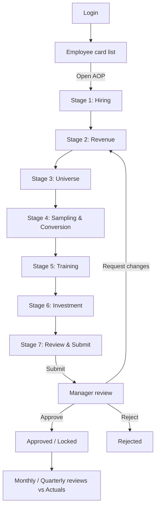

# 2. User Journey

## End-to-end journey

## Stage-by-stage purpose

| Stage | Purpose | Primary output |
|-------|---------|----------------|
| 1. Hiring | Identify manpower gaps before planning revenue | Hiring requests |
| 2. Revenue | Set FY targets by product category + AOV | Revenue targets |
| 3. Universe | Define addressable market and category mix | School universe + category plan + distributor map |
| 4. Sampling & Conversion | Plan sampling investment + conversion assumptions | Sampling + conversion plan |
| 5. Training | Plan academic interventions | Training plan |
| 6. Investment | Capture all territory spend | Investment plan |
| 7. Review | Validate, view KPIs, submit | Submitted AOP |

## Key UX moments
- **Continuity:** drafts auto-save per stage; users can leave and resume from the card
  list ("Continue draft").
- **Live feedback:** every stage shows computed KPIs immediately so the planner sees the
  consequence of each input.
- **Guardrails at the gate:** the Review stage surfaces error/warn/info flags; blocking
  errors prevent submission.
- **Delegation:** managers can plan on behalf of a subordinate using the same wizard,
  selected from the card list.

## Emotional design goals
Reduce planning anxiety with clear progress (stepper), trust through transparent math,
and a feeling of completeness on the review screen before the high-stakes submit.
