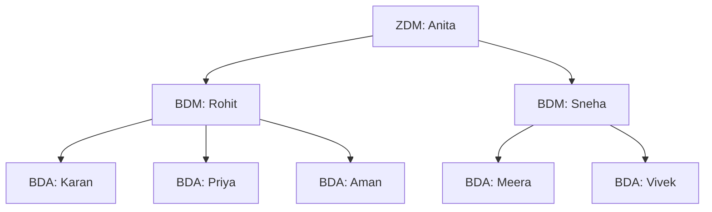

# 3. Role-Based Flow

## Capability matrix

| Capability | BDA | BDM | ZDM |
|-----------|:---:|:---:|:---:|
| View own card / AOP | Y | Y | Y |
| View subordinate cards/AOPs | - | Y (BDAs) | Y (BDMs + BDAs) |
| Fill / edit own AOP | Y | Y | Y |
| Fill AOP on behalf of subordinate | - | Y | Y |
| Submit own AOP | Y | Y | Y |
| Review subordinate AOP | - | Y | Y |
| Approve / reject / request changes | - | Y (BDAs) | Y (BDMs + BDAs) |
| Raise hiring request | - | Y | Y |
| Manage hiring status | - | - | Y |
| Leadership rollup dashboard | - | - | Y |

> Self-approval is never allowed. A plan is approved by someone strictly above the
> owner in `employee_hierarchy`.

## Visibility model
Visibility is the manager's subtree in the hierarchy closure table
`employee_hierarchy` (`depth > 0` = strict descendant). This makes "everything under me"
a single indexed query at any depth and is enforced in Postgres via RLS
(`can_access_user`, `can_edit_user`) and mirrored in the app (`useStore.visibleEmployees`).

## Per-role flow

### BDA
1. Login -> sees only their own card.
2. Open AOP -> complete stages 2-6 (Stage 1 hiring is read-only; raised by manager).
3. Submit -> status `submitted`, plan locks, awaits BDM approval.
4. If `changes_requested` -> plan reopens to `draft` for edits, then resubmit.

### BDM
1. Login -> sees own card + all BDA cards in their line.
2. Can open any BDA AOP to review/approve, or fill on their behalf.
3. Raise hiring requests for their territory lines.
4. Fill own AOP; submitted up to ZDM.

### ZDM
1. Login -> sees the whole zone (BDMs + BDAs).
2. Review/approve BDM and BDA plans; fill on behalf of anyone in the zone.
3. Manage hiring request status (Requested -> Approved -> In Progress -> Closed).
4. Leadership rollup dashboard: zone target, plan completion, revenue-at-risk, ranking.
