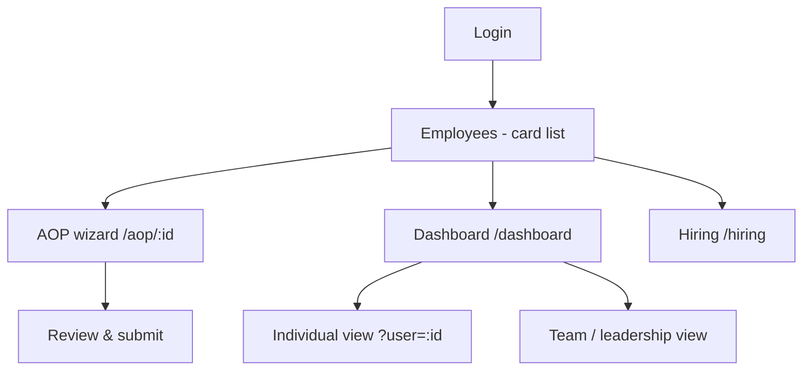
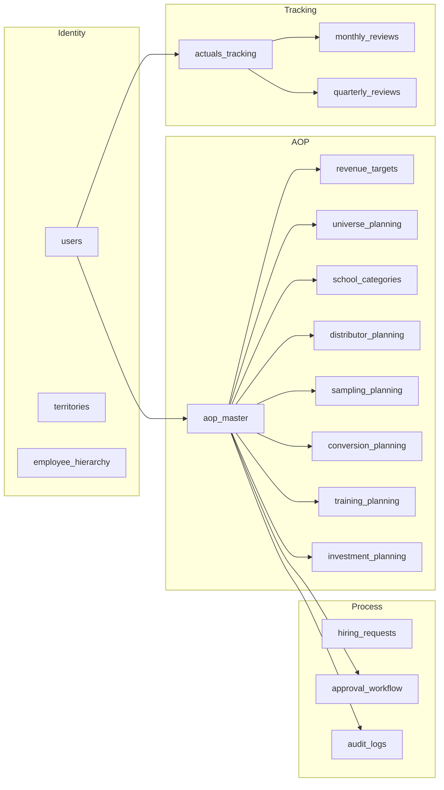

# 5. Information Architecture

## Navigation map

Primary navigation (persistent top bar + mobile bottom nav): **Employees**,
**Dashboard**, **Hiring**. Logout always available.

## Content domains

## Object hierarchy
- **User** belongs to one **Territory**, reports to one manager, has a closure of
  ancestors/descendants in **employee_hierarchy**.
- **AOP master** is the root planning object: one per `(user, fiscal_year)`.
- Each planning domain is a child of the AOP master (1:1 except `school_categories`
  which is 1:many).
- **Actuals / reviews** attach to user + fiscal year (and to the AOP for reviews).

## URL scheme
| Route | Screen |
|-------|--------|
| `/login` | Login |
| `/` | Employee card list |
| `/aop/[employeeId]` | AOP wizard for a specific employee |
| `/dashboard` | Role-aware dashboard |
| `/dashboard?user=[id]` | Individual dashboard for a focused user |
| `/hiring` | Hiring requests |

## Information density rules
- One concept per card; calculations always grouped under a "System calculations" or
  "Live calculations" header so users learn what is derived vs input.
- Read-only/auto fields are visually distinct (muted card) from inputs.
