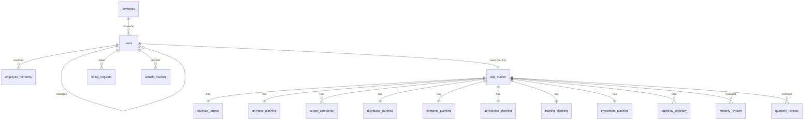

# 6. Database Schema

PostgreSQL (Supabase). DDL: [`/supabase/migrations/0001_schema.sql`](../supabase/migrations/0001_schema.sql).
18 tables. UUID PKs (`gen_random_uuid()`), money `numeric(14,2)` (INR), percentages
`numeric(5,2)`.

## Entity relationships

## Table catalog

### 1. territories
Master list of sales territories.
| Column | Type | Notes |
|--------|------|-------|
| id | uuid PK | |
| code | text UNIQUE | e.g. DEL-N |
| name, district, state, zone, base_location | text | |
| created_at | timestamptz | |
Indexes: `(zone)`, `(state)`.

### 2. users
Sales employees; `id` is 1:1 with `auth.users`.
| Column | Type | Notes |
|--------|------|-------|
| id | uuid PK -> auth.users(id) | |
| employee_code | text UNIQUE | |
| name, email(UNIQUE), designation, base_location, district_coverage | text | |
| role | role_t enum | ZDM/BDM/BDA |
| territory_id | uuid FK -> territories | |
| reporting_manager_id | uuid FK -> users (self) | nullable for top |
| current_revenue, current_target | numeric(14,2) | for achievement % |
| is_active | boolean | |
Indexes: `(role)`, `(reporting_manager_id)`, `(territory_id)`.

### 3. employee_hierarchy
Closure table for fast subtree visibility.
| Column | Type | Notes |
|--------|------|-------|
| ancestor_id | uuid FK -> users | PK part |
| descendant_id | uuid FK -> users | PK part |
| depth | int | 0 = self |
PK `(ancestor_id, descendant_id)`; index `(descendant_id)`.

### 4. aop_master
Root AOP object, one per `(user, fy)`.
| Column | Type | Notes |
|--------|------|-------|
| id | uuid PK | |
| user_id | uuid FK -> users | |
| fy | text | e.g. FY26-27 |
| status | aop_status_t | state machine |
| version | int | re-planning |
| submitted_at, approved_at | timestamptz | |
| updated_by | uuid FK -> users | audit |
UNIQUE `(user_id, fy)` (duplicate prevention). Indexes: `(user_id)`, `(status)`, `(fy)`.

### 5. revenue_targets (1:1 aop)
Historical (LY) values + targets + AOV/RPS. Generated columns: `revenue_growth_pct`,
`category_sum_target`. UNIQUE `(aop_id)`.

### 6. universe_planning (1:1 aop)
Universe counts + growth plans + text strategies. UNIQUE `(aop_id)`.

### 7. school_categories (1:many aop)
One row per category (`school_category_t`): current/target count, projected revenue,
projected conversion. UNIQUE `(aop_id, category)`.

### 8. distributor_planning (1:1 aop)
Existing/new distributor, strategic opportunity, bulk/institutional opportunities.

### 9. sampling_planning (1:1 aop)
7 sampling streams + cost-per-sample + unique factor. Generated:
`total_sampling_schools`.

### 10. conversion_planning (1:1 aop)
Conversion % + sampling-to-revenue/orders/new-schools estimates.

### 11. training_planning (1:1 aop)
8 training types + assumptions + expected impact. Generated: `total_trainings`.

### 12. investment_planning (1:1 aop)
12 cost lines. Generated: `total_investment`.

### 13. hiring_requests
Manpower requests raised by managers.
| Column | Type | Notes |
|--------|------|-------|
| id | uuid PK | |
| requested_by_user_id | uuid FK -> users | |
| for_territory_id | uuid FK -> territories | |
| base_location, district, state, designation | text | |
| number_of_positions | int CHECK >=1 | |
| priority | hiring_priority_t | |
| reason | hiring_reason_t | |
| business_justification | text | |
| expected_revenue_impact | numeric(14,2) | |
| hiring_timeline | text | YYYY-MM |
| status | hiring_status_t | |
Indexes: `(requested_by_user_id)`, `(status)`.

### 14. approval_workflow
Append-only event log per AOP: action (submit/approve/reject/request_changes),
by_user_id, comment. Index `(aop_id)`.

### 15. audit_logs
Generic change log: table_name, record_id, action, changed_by, `diff jsonb`. Indexes
`(table_name, record_id)`, `(changed_by)`.

### 16. actuals_tracking
Monthly actuals per user/FY for AOP-vs-Actual: revenue, schools active/new, samples,
conversions, investment spent. UNIQUE `(user_id, fy, period_month)`.

### 17. monthly_reviews
Per AOP per month: plan, actual, variance %, notes, reviewer. UNIQUE `(aop_id, period_month)`.

### 18. quarterly_reviews
Per AOP per quarter: plan, actual, variance %, RAG status, notes. UNIQUE `(aop_id, quarter)`.

## Derived view
`v_aop_kpis` joins aop_master + revenue + universe + investment + sampling + training to
expose consolidated KPIs (revenue growth, AOV growth, investment %, ROI %, totals) for
dashboards and reporting without recomputation.
