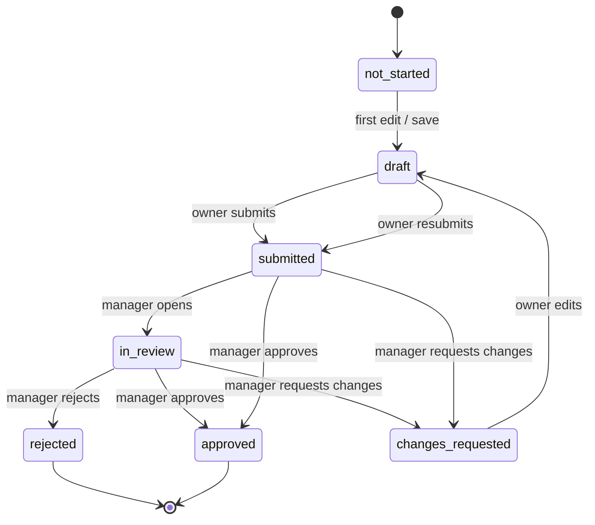

# 11. Approval Workflow

## Status state machine

## Rules
- **Owner** can only `submit` their own plan (and edit while `draft`/`changes_requested`).
- **Manager** (strict ancestor) can `approve`, `reject`, or `request_changes`.
- **No self-approval** (DB-enforced in the approval insert policy).
- On `submit`/`in_review`/`approved`, planning tables are locked by trigger.
- `request_changes` reopens the plan (status -> `changes_requested` -> `draft` on edit).

## Approval chain
A BDA's plan is approved by their BDM (or ZDM above). A BDM's plan is approved by their
ZDM. Because policies use the hierarchy closure, any strict ancestor can act, supporting
escalation and skip-level approvals.

## Audit trail
Every action writes an immutable row to `approval_workflow`:
`(aop_id, action, by_user_id, comment, created_at)`. The Review screen renders this as
"Approval history". Generic field-level changes can additionally be captured in
`audit_logs` via triggers.

## Prototype implementation
- `useStore.recordApproval(userId, action, comment)` appends the event and transitions
  `aop_master.status`.
- Review stage shows Approve / Request changes / Reject (with comment) only to a valid
  approver when status is `submitted`/`in_review`.
- Edit-lock surfaced as a read-only banner in the wizard when status is locked.

## Notifications (production)
On each transition, emit an event (Supabase Realtime / Edge Function) to notify:
- Owner when `changes_requested`/`rejected`/`approved`.
- Manager when a subordinate `submits`.
SLA timers can escalate stale `submitted` plans to the next level.
